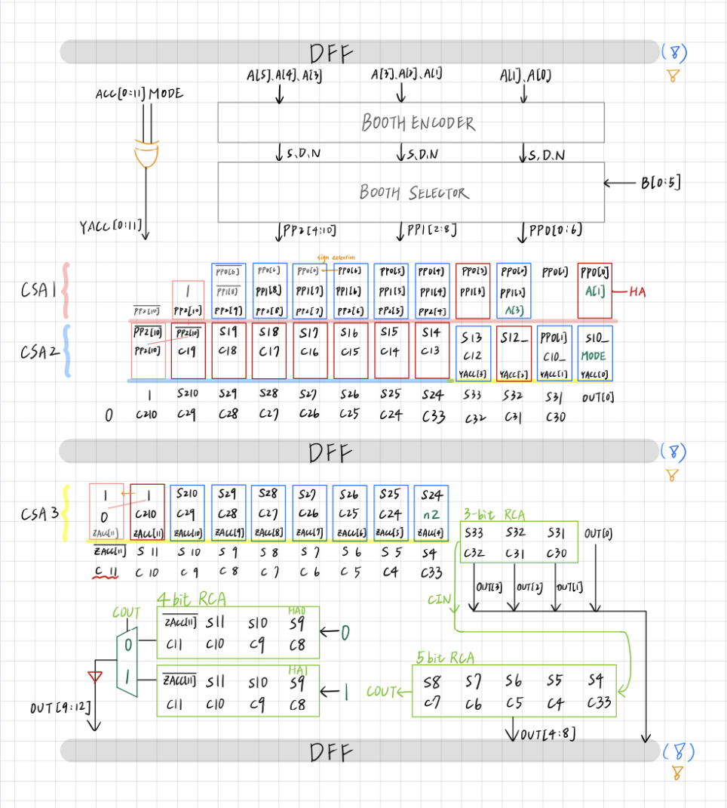
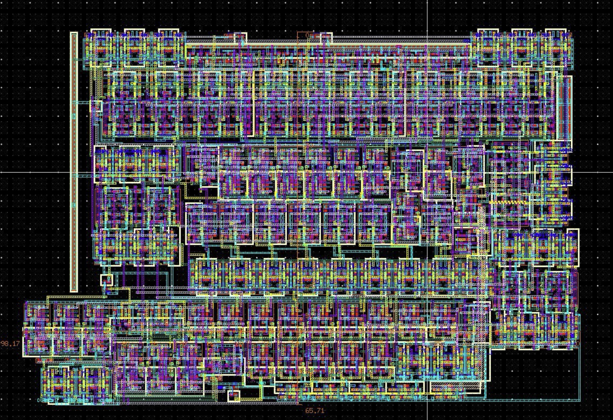
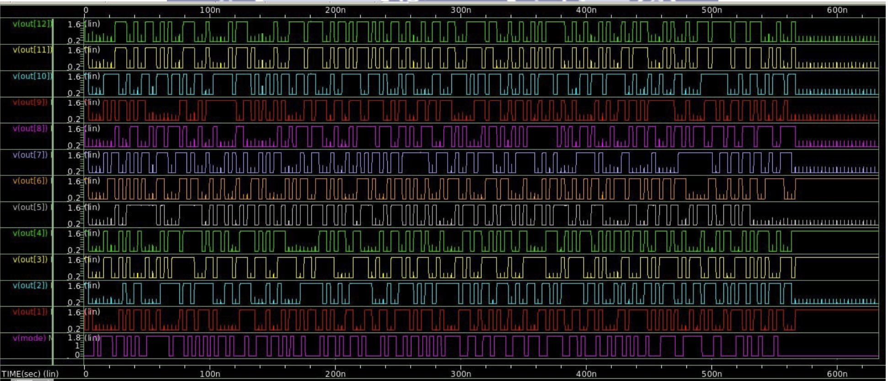

**Contributors**
Lucian(Chia-Huang) Chen [https://github.com/Lucian0928]
Audrey(Yen-Yu) Chen [https://github.com/audreyYYC]

## Design Objective

This is a collaborative project and I completed this project with Yen-Yu Chen. The objective of this project is to design and optimize a **6-bit Multiplier and Accumulator (MAC)** using a full-custom VLSI design flow, with emphasis on **arithmetic architecture selection**, **pipeline placement**, and **post-layout timing behavior**.

---

## Architecture Overview

  

The MAC adopts a hierarchical arithmetic structure including:

- Radix-4 booth encoder and selector
- Carry-Save Adder tree and Ripple-Carry Adder for partial product reduction
- Pipeline registers inserted at timing-critical boundaries

---

## Timing-Oriented Design Approach

Design decisions were guided by post-layout timing analysis:

- Booth encoding was selected to reduce multiplier depth
- CSA stages minimized carry propagation delay
- Pipeline cutsets were chosen based on extracted critical paths
- Additional buffering was applied selectively to long interconnects

This approach emphasizes **timing awareness at the architectural level**, which is central to high-performance digital IC design.

---

## Performance Summary and Attribution

To maintain clarity in collaborative attribution, two versions of the design are documented.

### Course Final Submission

- Pre-sim critical path delay: **1.17 ns**
- Post-sim critical path delay: **3.01 ns**
- Transistor count: **2257**

### Layout Result

  

- Area: 6406.45 $\mu m^2$

### Waveform

<table>
  <tr>
    <td align="center"><b>Pre-Simulation</b></td>
    <td align="center"><b>Post-Simulation</b></td>
  </tr>
  <tr>
    <td>
      
    </td>
    <td>
      
    </td>
  </tr>
</table>

---

## Additional Optimization by Chia-Hunag Chen

- Post-layout critical path delay: **2.6 ns**
- Transistor count: **~2500**
- Achieved through additional buffer insertion and critical-path refinement
- Performed independently after course completion

---

